# Fastapi接口 - XXXX监测系统

## 接口文档
1. http://127.0.0.1:XXXX/docs
2. http://127.0.0.1:XXXX/redoc
> 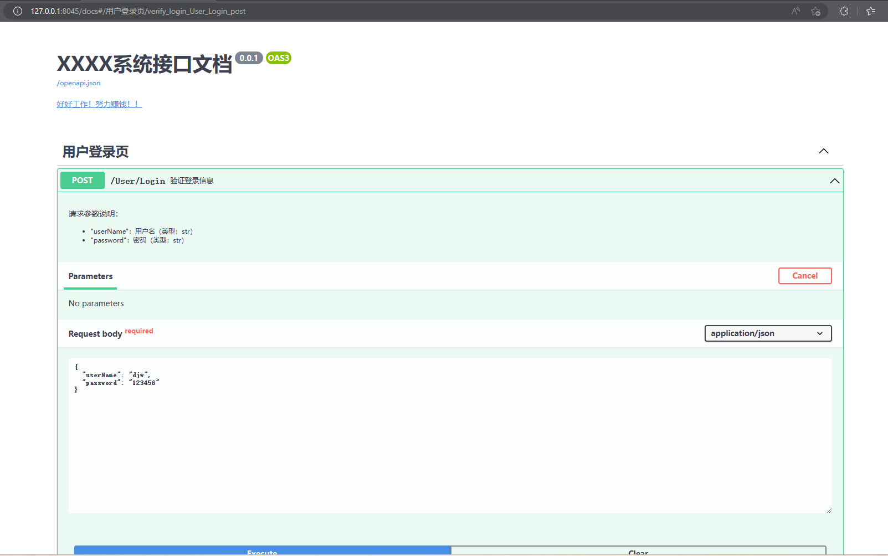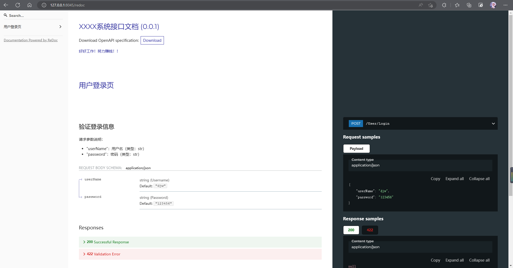

## 配置文件的使用
1. 首次使用，可以打开 “config.py” 对本项目配置信息进行设置，一般只设置如图红色框标记部分
> 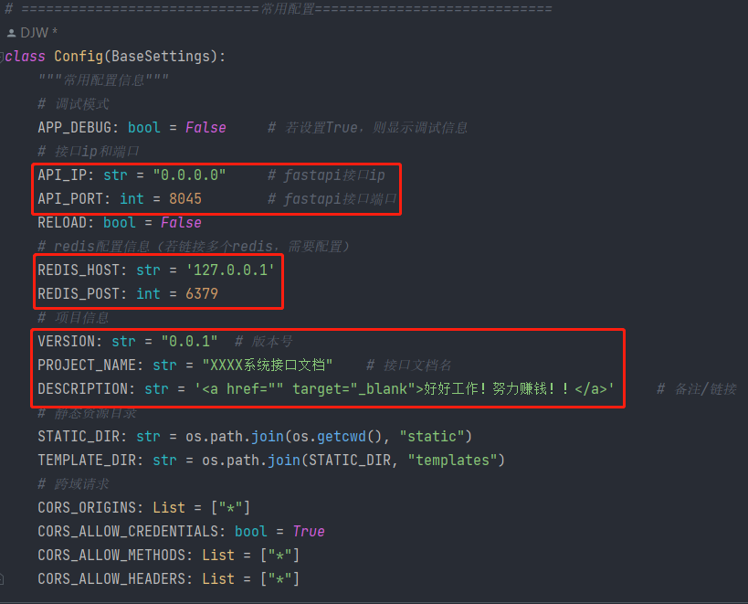
2. 配置mysql数据库时, “connections” 中一个键值对应一个数据库的配置，若想在本项目中连接多个数据库则需要按照同样格式添加键值，具体参考如图所示绿色框注释部分。
然后在 “apps” 中，一个键值对应连接一个数据库的配置。配置中 “default_connection” 的值对应 “connections” 中的键值信息。 
 “models” 一般默认为空，若要配置具体看黄色标注部分。
> 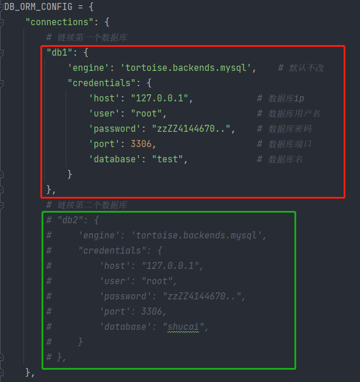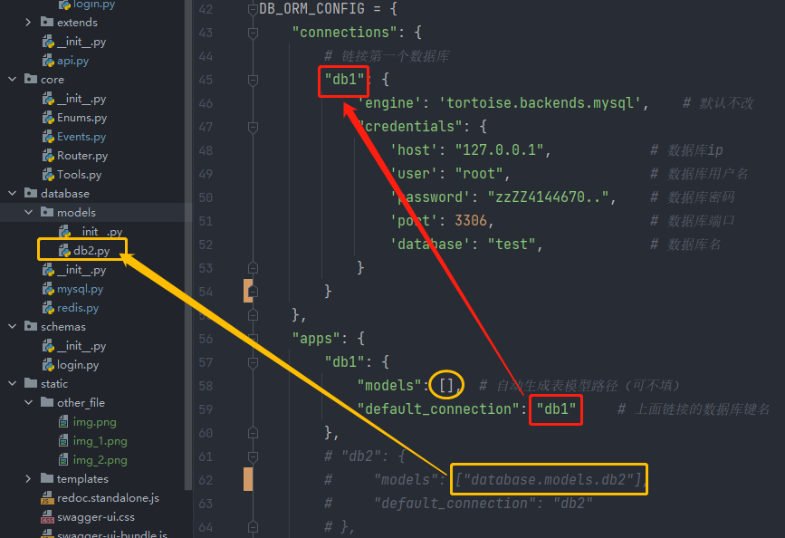
3. 当配置好后，执行 “python main.py” 即可运行本项目，运行成功后如下图
> 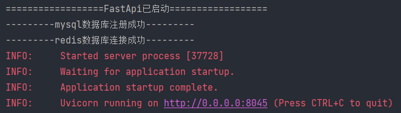

## 项目结构：
蓝色为文件夹，
绿色为项目文件，
红色为重要文件/文件夹，
白色为不重要文件/文件夹

1. api（接口）
   1. endpoints：用于存放各个主要接口文件
      1. ***.py
      2. ...
   2. extends：用于存放各个扩展接口文件
      1. ***.py
      2. ...
   3. api.py：用于将所有接口汇总在一起
2. core(核心)
   1. Enums.py：用于存放各枚举类
   2. Events.py：fastapi事件监听
   3. Router.py：路由聚合
   4. Tools.py：提供一些功能的函数或类
3. database（数据库）
   1. models：存放定义的数据库表模板，使用时可以在数据库中自动创建表
      1. ***.py
      2. ...
   2. mysql.py：用于连接mysql数据库的程序
   3. redis.py：用于连接redis数据库的程序
4. schemas（接口请求体模板）
   1. endpoints：用于存放各个主要接口请求体模板文件
      1. ***.py
      2. ...
   2. extends：用于存放各个扩展接口请求体模板文件
      1. ***.py
      2. ...
5. static（静态文件）
   1. img：存放图片
   2. other_file：用于存放本项目中其他静态文件，例如excel、word等等
   3. templates（暂时用不到）：用于存放各种视图页
   4. redoc.standalone.js：使交互文档能够在离网访问
   5. swagger-ui.css：使交互文档能够在离网访问
   6. swagger-ui-bundle.js：使交互文档能够在离网访问
6. config.py（配置文件）：用于设置整个项目的配置信息
7. main.py（运行文件）：程序运行的入口
8. requirement.txt：必要安装第三方库

## 数据库操作
1. mysql数据库操作
> 1.包含tortoise类 
> 
> 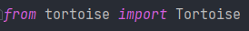
>
> 2.选择使用连接的数据库，要注意参数和数据库配置 ”connections“ 中的键一致，若连接了多个数据库，则可以通过配置的键来选择使用哪个数据库
> 
> 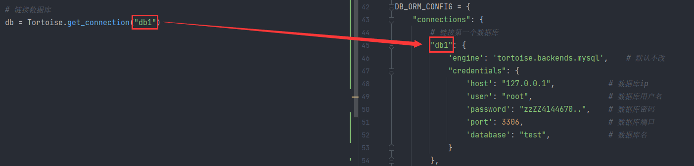
> 
> 3.编写sql语句，并将sql语句作为参数，异步执行execute_query_dict()方法，查询结果以列表字典的形式赋给result变量
> 
> 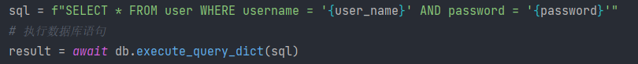
2. redis数据库操作
> 1.包含：fastapi中的Depends类，database/redis.py文件中sys_cache()函数和aioredis中的Redis类
> 
> 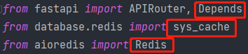
> 
> 2.在使用接口函数时，按下图写法注入依赖
> 
> 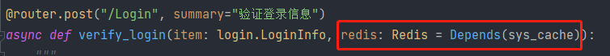
> 
> 3.基本设置/获取键值操作：通过异步执行 “redis.set()” 和 “redis.get()” 的方法，name参数为键名，value为值，ex为过期时间（单位：秒，不写则为永久存活）
> 
> 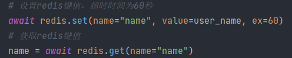
> 
> 4.redis的其他操作：通过 “redis.” 就可以自动提示该类下的所有方法
> 
> 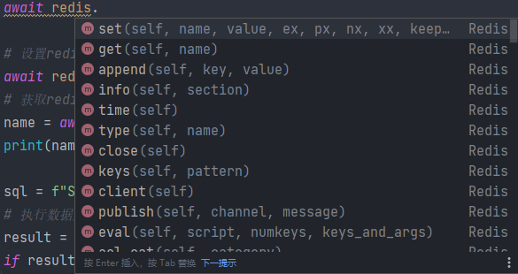

## 程序打包exe过程
1. 终端执行第一次打包命令：pyinstaller -F -p 当前项目目录\venv\Lib\site-packages main.py
2. 修改生成的“main.spec”文件中“hiddenimports”内容：hiddenimports=["uvicorn.loops","uvicorn.loops.auto","uvicorn.protocols.http.auto","uvicorn.lifespan","uvicorn.lifespan.on","tortoise.backends.mysql"],
3. 对“main.spec”文件执行打包命令生成新的exe文件：pyinstaller .\huiyi_api.spec

程序打包exe后的注意事项
1. 生成的“main.exe”文件如果运行必须携带项目中的“static”目录

## 更新日志
1. 第一次提交。时间：XXXX/XX/XX XX:XX:XX

## fastapi学习
1. github 仓库：https://github.com/binkuolo/fastap
2. gitee 仓库：https://gitee.com/binkuolo/fastapi
3. 哔哩哔哩视频教程：https://www.bilibili.com/video/BV13F411u76R

## 其他参考链接
fastapi官方文档：https://fastapi.tiangolo.com/zh/
aioredis官方文档：https://aioredis.readthedocs.io/en/latest/