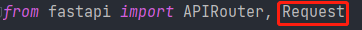
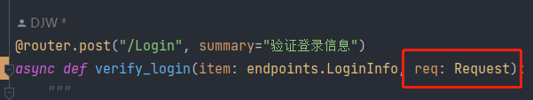
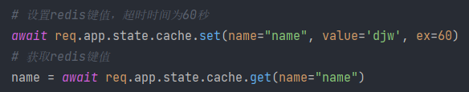
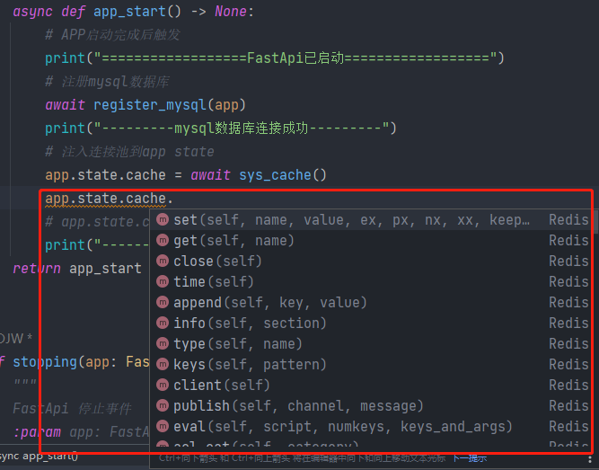
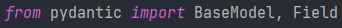
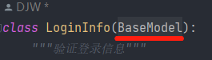
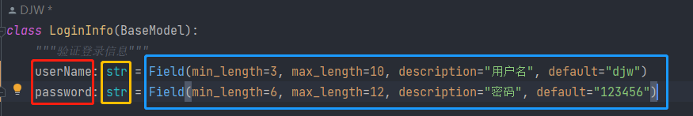
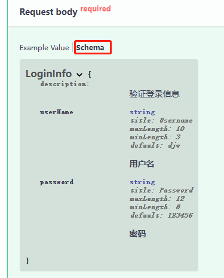

# Fastapi接口 - XXXX监测系统
### 目录
> 一、项目结构
> 
> 二、交互式接口文档的使用
> 
> 三、配置文件的使用
> 
> 四、数据库操作（mysql、redis）
> 
> 五、schemas请求体body模型的使用
> 
> 六、程序打包exe的方法
> 
> 七、更新日志
> 
> 八、fastapi学习
> 
> 九、官方文档参考链接
> 
## 一、项目结构：
蓝色为文件夹，
绿色为项目文件，
红色为重要文件/文件夹，
白色为不重要文件/文件夹

1. api（接口）
   1. endpoints：用于存放各个主要接口文件
      1. ***.py
      2. ...
   2. extends：用于存放各个扩展接口文件
      1. ***.py
      2. ...
   3. api.py：用于将所有接口汇总在一起
2. core(核心)
   1. Enums.py：用于存放各枚举类
   2. Events.py：fastapi事件监听
   3. Router.py：路由聚合
   4. Tools.py：提供一些功能的函数或类
3. database（数据库）
   1. models：存放定义的数据库表模板，使用时可以在数据库中自动创建表
      1. ***.py
      2. ...
   2. mysql.py：用于连接mysql数据库的程序
   3. redis.py：用于连接redis数据库的程序
4. schemas（接口请求体模板）
   1. endpoints.py：用于编写各个主要接口请求体模板
   2. extends.py：用于编写各个扩展接口请求体模板
5. static（静态文件）
   1. img：存放图片
   2. other_file：用于存放本项目中其他静态文件，例如excel、word等等
   3. templates（暂时用不到）：用于存放各种视图页
   4. redoc.standalone.js：使交互文档能够在离网访问
   5. swagger-ui.css：使交互文档能够在离网访问
   6. swagger-ui-bundle.js：使交互文档能够在离网访问
6. config.py（配置文件）：用于设置整个项目的配置信息
7. main.py（运行文件）：程序运行的入口
8. requirement.txt：必要安装第三方库

## 二、交互式接口文档的使用
运行fastapi程序后，在浏览器中，根据配置的ip和端口打开以下链接，打开效果如下图
1. http://127.0.0.1:XXXX/docs
2. http://127.0.0.1:XXXX/redoc
> 

## 三、配置文件的使用
1. 首次使用，可以打开 “config.py” 对本项目配置信息进行设置，一般只设置如图红色框标记部分
> 
2. 配置mysql数据库时, “connections” 中一个键值对应一个数据库的配置，若想在本项目中连接多个数据库则需要按照同样格式添加键值，具体参考如图所示绿色框注释部分。
然后在 “apps” 中，一个键值对应连接一个数据库的配置。配置中 “default_connection” 的值对应 “connections” 中的键值信息。 
 “models” 一般默认为空，若要配置具体看黄色标注部分。
> 
3. 当配置好后，执行 “python main.py” 即可运行本项目，运行成功后如下图
> 

## 四、数据库操作（mysql、redis）
1. mysql数据库操作
> 1.包含tortoise类 
> 
> 
>
> 2.选择使用连接的数据库，要注意参数和数据库配置 ”connections“ 中的键一致，若连接了多个数据库，则可以通过配置的键来选择使用哪个数据库
> 
> 
> 
> 3.编写sql语句，并将sql语句作为参数，异步执行execute_query_dict()方法，查询结果以列表字典的形式赋给result变量
> 
> 
2. redis数据库操作
> 1.包含：fastapi中的Request类
> 
> 
> 
> 2.在使用接口函数时，引入Request
> 
> 
> 
> 3.基本设置/获取键值操作：通过异步执行 “req.app.state.cache.set()” 和 “req.app.state.cache.get()” 的方法，name参数为键名，value为值，ex为过期时间（单位：秒，不写则为永久存活）
> 
> 
> 
> 4.redis的其他操作：可以通过"./core/Events.py"文件中，在下图位置输入“app.state.cache.”的方式查看其他方法，或参考aioredis文档中的方法
> 
> 

## 五、schemas请求体body模型的使用
1. 验证请求体 pydantic 库的使用：
> 1.包含pydantic库的 BaseModel, Field
> 
> 
> 
> 2.创建请求体类时，继承BaseModel类
> 
> 
> 
> 3.编辑请求体字段，格式为：
> 
> >字段 : 验证类型 = Field(default="###", description="###")
> >
> >
> >
> >关于Field()方法的参数说明：
> >
> >| 参数名称                | 描述                                                        |
> >| ---------------------- | ----------------------------------------------------------- |
> >| default                 | （位置参数）字段的默认值。由于Field替换了字段的默认值，因此第一个参数可用于设置默认值。使用省略号 ( …) 表示该字段为必填项。 |
> >| default_factory         | 当该字段需要默认值时将被调用。除其他目的外，这可用于设置动态默认值。禁止同时设置default和default_factory。 |
> >| alias                   | 字段的别名                                                  |
> >| description             | 文档字符串                                                  |
> >| exclude                 | 在转储（.dict和.json）实例时排除此字段                      |
> >| include                 | 在转储（.dict和.json）实例时（仅）包含此字段                |
> >| const                   | 此参数必须与字段的默认值相同（如果存在）                    |
> >| gt                      | 对于数值 ( int, float, )，向 JSON SchemaDecimal添加“大于”的验证和注释exclusiveMinimum |
> >| ge                      | 对于数值，这将添加“大于或等于”的验证和minimumJSON 模式的注释 |
> >| lt                      | 对于数值，这会为exclusiveMaximumJSON Schema添加“小于”的验证和注释 |
> >| le                      | 对于数值，这将添加“小于或等于”的验证和maximumJSON 模式的注释 |
> >| multiple_of             | 对于数值，这会multipleOf向 JSON Schema添加“多个”的验证和注释 |
> >| max_digits              | 对于Decimal值，这将添加验证以在小数点内具有最大位数。它不包括小数点前的零或尾随的小数零。 |
> >| decimal_places          | 对于Decimal值，这增加了一个验证，最多允许小数位数。它不包括尾随十进制零。 |
> >| min_itemsminItems       | 对于列表值，这会向 JSON Schema添加相应的验证和注释          |
> >| max_itemsmaxItems       | 对于列表值，这会向 JSON Schema添加相应的验证和注释          |
> >| unique_itemsuniqueItems | 对于列表值，这会向 JSON Schema添加相应的验证和注释          |
> >| min_lengthminLength     | 对于字符串值，这会向 JSON Schema添加相应的验证和注释        |
> >| max_lengthmaxLength     | 对于字符串值，这会向 JSON Schema添加相应的验证和注释        |
> >| allow_mutation          | 一个布尔值，默认为True. TypeError当为 False 时，如果在实例上分配了字段，则该字段引发 a 。模型配置必须设置validate_assignment为True执行此检查。 |
> >| regex                   | 对于字符串值，这会添加从传递的字符串生成的正则表达式验证和patternJSON 模式的注释 |
> >| repr                    | 一个布尔值，默认为True. 当为 False 时，该字段应从对象表示中隐藏。 |
> >| **                      | 任何其他关键字参数（例如examples）将逐字添加到字段的架构中  |
2. schemas在交互式文档中的查看：点击 “Schema” 就可以在请求体和模板之间切换

## 六、程序打包exe的方法

1. 终端执行第一次打包命令：pyinstaller -F -p 当前项目目录\venv\Lib\site-packages main.py
2. 修改生成的“main.spec”文件中“hiddenimports”内容：hiddenimports=["uvicorn.loops","uvicorn.loops.auto","uvicorn.protocols.http.auto","uvicorn.lifespan","uvicorn.lifespan.on","tortoise.backends.mysql"],
3. 对“main.spec”文件执行打包命令生成新的exe文件：pyinstaller .\huiyi_api.spec

程序打包exe后的注意事项
1. 生成的“main.exe”文件如果运行必须携带项目中的“static”目录

## 七、更新日志
1. 第一次提交。时间：XXXX/XX/XX XX:XX:XX

## 八、fastapi学习
1. github 仓库：https://github.com/binkuolo/fastap
2. gitee 仓库：https://gitee.com/binkuolo/fastapi
3. 哔哩哔哩视频教程：https://www.bilibili.com/video/BV13F411u76R

## 九、官方文档参考链接
1. fastapi官方文档：https://fastapi.tiangolo.com/zh/
2. aioredis官方文档：https://aioredis.readthedocs.io/en/latest/